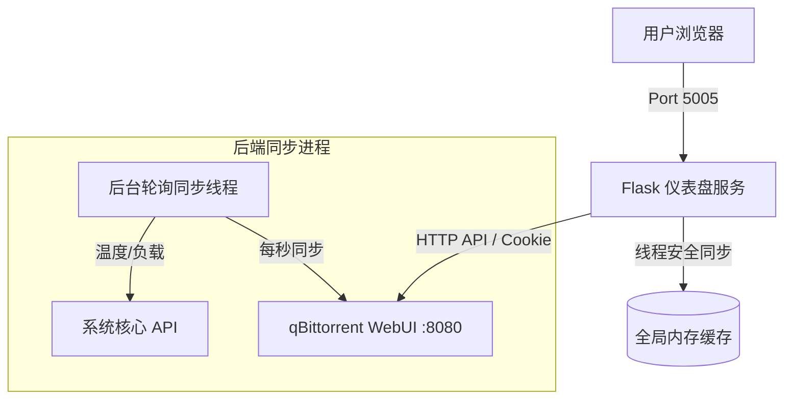

# 🍏 Apple Torrent Dashboard (Torrent Omni)

这是一个精美的、仿苹果设计风格（Apple Design & VueTorrent Suite）的 qBittorrent 监控与管理 Web 面板。它能以极高颜值可视化地展示您的下载速率、网络流量趋势图、服务器 CPU/内存/磁盘状态，并支持完整的种子添加、暂停、删除、限速、RSS 规则定义以及 Tracker 批量补充等功能。

---

## 🎨 页面预览与架构



---

## 🌟 特性与重构优化

1. **企业级线程安全**：重构了全局共享缓存的同步机制，引入 `threading.Lock` 锁机制，杜绝多线程读写下的状态竞态与脏数据隐患。
2. **极速智能日志扫描**：优化了原有暴力扫描日志的性能瓶颈。新逻辑利用文件修改时间（mtime）进行降序排序，**仅读取最新生成的 5 个日志**提取密码，完美规避了海量历史日志引发的服务器 I/O 挂起灾难。
3. **内置安全防线**：支持通过环境变量 `DASHBOARD_PASSWORD` 激活 **HTTP Basic Authentication** 认证。一旦配置密码，全站路由与 API 接口将立即锁闭，有效防范公网被黑客扫描和未授权篡改。
4. **兜底密码适配**：在临时密码提取失败时，新增 `adminadmin`（qBittorrent 默认新密码）和 `admin` 兜底认证，大幅提升了对原生环境的开箱即用兼容性。
5. **解耦前端渲染**：重构了前端 `openTorrentDetail` 逻辑。卡片交互不再传递易受名称特殊字符（如单/双引号、反斜杠）影响的字符串，直接通过哈希值从全局数据查找，杜绝了 JS 报错与 XSS 注入风险。

---

## 🚀 一键部署

我们提供了一键自动化部署脚本：

```bash
# 给予脚本执行权限
chmod +x deploy.sh

# 运行一键配置并启动
./deploy.sh
```

`deploy.sh` 会自动完成以下操作：
1. 检测当前主机的 Python 3 环境。
2. 创建独立的 Python 虚拟环境 `venv`。
3. 升级 pip 并安装所有依赖包（包含生产级 Web 容器 `gunicorn`）。
4. **服务常驻守护注册**：
   - 如果系统装有 **PM2**：自动加载 `ecosystem.config.js` 启动并托管名为 `apple-torrent-dashboard` 的项目。
   - 如果未装 PM2：自动在当前目录生成标准的 `systemd` 服务配置文件，并指引您如何完成系统服务注册。

---

## ⚙️ 配置文件与安全设置

项目的环境参数在 [`ecosystem.config.js`](ecosystem.config.js) 中进行管理。您可以根据需要进行调整：

```javascript
env: {
  NODE_ENV: "production",
  
  // 1. 指定 qBittorrent 服务的 WebUI 地址 (必填)
  QBT_HOST: "http://127.0.0.1:8080",
  
  // 2. 为您的面板设定安全访问密码 (推荐)
  // 如果此项留空 ""，则面板为免密直接访问；如果填入密码，任何人访问网页都需要输入密码登录。
  DASHBOARD_PASSWORD: "您的安全访问密码",
}
```

### 应用配置变更
修改完 `ecosystem.config.js` 后，在终端执行以下命令重载生效：
```bash
pm2 restart ecosystem.config.js --update-env
```

---

## 📁 手动部署与开发调试

如果您不想使用 PM2，也可以手动按以下步骤部署或调试：

```bash
# 1. 创建并激活虚拟环境
python3 -m venv venv
source venv/bin/activate

# 2. 安装依赖
pip install -r requirements.txt

# 3. 运行调试服务器 (默认监听 5005 端口)
python3 app.py
```
