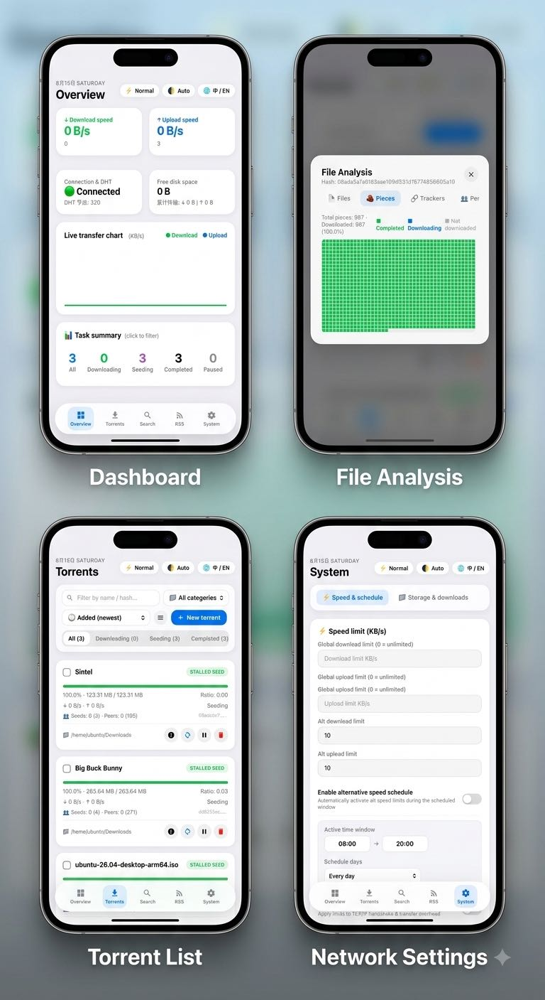

# 🍏 Abit — Apple Style qBittorrent Alternative WebUI

> **Language:** English ([README.md](README.md)) · **中文** (本文件)

> *An Apple-style alternative Web UI for qBittorrent — beautiful, lightweight, frosted-glass design.*

<p align="center">
  
</p>

这是一个精美、轻量、高颜值的 **qBittorrent 自定义备用 WebUI 主题（Alternative Web UI）**，采用现代化 Apple iOS / macOS 磨砂毛玻璃视觉设计风格。

直接与 qBittorrent 原生 WebAPI 通信，完全运行在浏览器沙箱中。无需配置 Python/Node 后端服务，即开即用。

---

## 📐 系统架构与目录结构

本项目采用**模块化开发源码（`src/`）与单文件零依赖发布产物（`dist/` / `public/`）分离**的标准工程架构：

```
Abit/
├── src/                    # 源码开发目录 (Modular Source Code)
│   ├── index.html          # 开发态模板入口 (Development Template)
│   ├── css/                # 模块化样式表 (Modular CSS)
│   │   ├── variables.css   # 主题色板与 CSS 变量 (Variables & Themes)
│   │   ├── base.css        # 基础重置与排版 (Reset & Typography)
│   │   ├── layout.css      # 栅格布局与容器 (Grid & Containers)
│   │   ├── components.css  # 通用组件与徽标 (Buttons, Cards, Toasts, Pagination)
│   │   ├── torrents.css    # 种子卡片/列表与操作栏 (Torrents UI)
│   │   ├── dock.css        # 底部毛玻璃导航 Dock 栏 (Bottom Dock UI)
│   │   ├── modal.css       # 模态弹窗与详情抽屉 (Modals & Drawers)
│   │   └── style.css       # CSS 模块统一引用入口
│   └── js/                 # 模块化逻辑脚本 (Modular JavaScript)
│       ├── i18n.js         # 中英双语与语言持久化 (zh/en i18n & persistence)
│       ├── constants.js    # 全局常量与预设插件库 (Constants & Presets)
│       ├── state.js        # 全局状态管理 (State Management)
│       ├── utils.js        # 格式化/防抖/XSS安全工具 (Helpers & Sanitizers)
│       ├── api.js          # API 请求拦截与认证 (API Layer)
│       ├── chart.js        # 实时网络速率折线图 (Speed Chart)
│       ├── torrents.js     # 种子管理/过滤/详情/操作 (Torrent Logic)
│       ├── search.js       # 资源全网检索与插件系统 (Search & Plugins)
│       ├── rss.js          # RSS 订阅与自动下载规则 (RSS Engine)
│       ├── system.js       # 系统偏好/分类/Tracker/日志 (System & Logs)
│       ├── ui.js           # 页面导航/主题/快捷键/拖拽 (UI & Interactivity)
│       └── app.js          # 主入口与自适应轮询调度 (App Entry & Polling)
├── scripts/                # 构建与开发自动化工具 (Build & Dev Tooling)
│   ├── build.js            # 零依赖一键打包构建脚本 (Zero-dep Bundler)
│   ├── dev.js              # 零依赖本地轻量开发服务器 (Local Dev Server)
│   └── check.js            # 模块语法与工程完整性检查 (Integrity Checker)
├── dist/                   # 单文件发布产物目录 (Production Standalone)
│   ├── index.html          # 单文件独立完整版 (Standalone Single-File WebUI)
│   ├── css/style.css       # 合并打包后的全量样式 (Bundled CSS)
│   └── js/app.bundle.js    # 合并打包后的全量逻辑 (Bundled JS)
├── public/                 # 多文件模块化静态发布目录 (Modular Multi-File WebUI，推荐 WebUI 指向此目录)
│   ├── index.html          # 结构化多文件入口 (Modular HTML Entry)
│   ├── css/                # 细分样式模块目录 (8 个独立 CSS 模块)
│   └── js/                 # 细分逻辑模块目录 (11 个独立 JS 模块)
├── index.html              # 根目录单文件镜像入口
├── package.json            # NPM 项目工程描述文件
├── .gitignore              # Git 忽略规则
└── README.md               # 项目开发与部署指南（英文）
```

---

## 🌟 核心特性

1. **零资源开销**：完全由浏览器解析运行，服务器不需要开启任何额外的 Python/Node 后台程序或占用额外端口。
2. **纯原生 API 驱动**：所有操作（获取种子、添加磁力、限速设置、RSS 订阅规则编辑、全网检索）全部通过浏览器直接发请求给 qBittorrent 原生接口。
3. **数据展现优化**：
   - qBittorrent 网络连接状态、DHT 节点数实时监控。
   - 实时上传/下载速率平滑曲线趋势图。
   - 磁盘可用空间与历史总传输量统计。
4. **现代化交互体验**：
   - 🌓 自动/浅色/深色模式切换。
   - 🌐 简体中文 / English 双语切换（选择后自动持久化保存）。
   - 🗂️ 网格卡片（Card Grid）与紧凑表格（Table View）双视图无缝切换。
   - ⚡ 批量管理操作、安全确认弹窗、右键与拖拽添加种子文件、剪贴板磁力识别。
   - ⌨️ 快捷键支持（`1-5` 切换导航，`/` 或 `F` 搜索任务，`N` 新建任务，`Esc` 关闭弹窗）。
   - 🔍 全网检索支持 14 个真实高效官方/社区插件、每页 20 条分页及连续序号高亮；搜索结果自动持久化，刷新页面不丢失。

---

## 🛠️ 本地开发与构建命令

项目内置了纯 Node.js 驱动的零依赖开发与构建工具链：

```bash
# 1. 代码完整性与语法检查
npm run check
# 或
node scripts/check.js

# 2. 启动本地轻量开发服务器（支持 Mock 离线预览与代理至真实 qBt）
npm run dev
# 或代理到真实 qBittorrent 服务:
node scripts/dev.js --qbt=http://127.0.0.1:8080

# 3. 执行生产构建（自动打包 CSS/JS 并同步产物）
npm run build
# 或
node scripts/build.js
```

---

## ⚡ 一键智能安装与配置（极力推荐）

无论您是初次安装还是更新已有配置，直接在服务器终端运行下方一键安装命令，脚本将**自动检测安装路径、自动检索 qBittorrent 配置文件、自动写入备用 WebUI 路径并优雅重启生效**：

```bash
# 方式 A：单行远程一键安装（无需预先 clone，全自动搞定）
curl -sSL https://raw.githubusercontent.com/Level6me/Abit/main/install.sh | bash

# 方式 B：在已下载的项目目录中一键配置
bash install.sh
```

`install.sh` 支持多平台（Debian/Ubuntu、Fedora/RHEL、Arch、Alpine、macOS）与 Docker 部署模式，并内置：
- 自动安装 qBittorrent / Node.js（按平台包管理器）
- 端口可配：`ABIT_EXT_PORT=8090 bash install.sh`
- 安全模式与兼容模式：`ABIT_INSECURE=1 bash install.sh`（关闭 CSRF/本机认证校验，请勿直接暴露公网）
- PM2 开机自启、更新重跑、卸载：`bash install.sh uninstall`

---

## 🚀 手动部署与备用 WebUI 配置

若您希望手动配置：

1. **获取最新源码并编译**：
   ```bash
   git clone https://github.com/Level6me/Abit.git /home/ubuntu/Abit
   cd /home/ubuntu/Abit
   node scripts/build.js
   ```
2. **启用备用 Web UI**：
   - 登录您的 qBittorrent 网页控制台（或直接编辑 `~/.config/qBittorrent/qBittorrent.conf`）。
   - 在 **“使用备用 Web UI (Use alternative Web UI)”** 下，将 **“文件路径 (Files path)”** 设置为项目的**根目录**（例如 `/home/ubuntu/Abit`）：
     ```ini
     WebUI\AlternativeUIEnabled=true
     WebUI\RootFolder=/home/ubuntu/Abit
     ```
3. **保存并重启 qBittorrent**：
   - 重启服务后刷新浏览器页面，即可开始体验精美的苹果风格 Abit 备用面板！

---

## ❓ 常见问题

* **Q：打开页面提示 `Unacceptable file type, only regular file is allowed` 是怎么回事？**
  * **A**：请确保 `WebUI\RootFolder` 指向的是项目根目录（例如 **`/home/ubuntu/Abit`**，该目录下包含 `public/` 文件夹）。qBittorrent 原生内核会自动在 `RootFolder/public/` 下查找页面。
* **Q：为什么访问页面时显示“离线/未登入”？**
  * **A**：主题直接通过当前浏览器的 Session 会话进行 API 通信。若显示离线，请先在弹出的登录窗口输入您的 qBittorrent 账密进行登录，验证通过后即可恢复在线。
* **Q：搜索结果的「下载」按钮点了没反应/任务未出现？**
  * **A**：若该搜索结果只提供了下载页链接（而非磁力或 `.torrent` 直链），qBittorrent 无法直接解析。新版页面会先自动解析下载页提取磁力链接；若仍失败，请复制磁力链接后通过「新建任务」添加。
* **Q：修改了 `src/` 中的代码后如何生效？**
  * **A**：运行 `npm run build` 或 `node scripts/build.js`，脚本会自动将模块化代码合并生成最新的发布产物。
